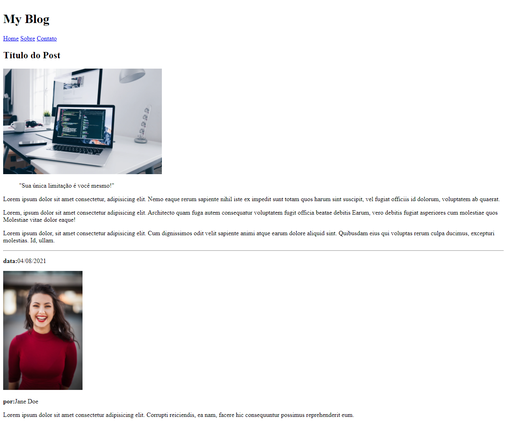

# 5. [Blog Post](https://mellcosta.github.io/desafiosRocketseat/iniciante/desafios_html/5_blog_post/blog_post.html)

## 💻 Sobre o desafio

---

Nesse desafio você deve criar a estrutura **HTML** para a página de post de um blog.

## Iniciando o projeto

Primeiro vamos criar o arquivo HTML, você pode dar qualquer nome para este arquivo, desde que use a extensão `.html`. Exemplo: **blog-post.html** 

Para criar a estrutura base do HTML no Visual Studio Code, você pode digitar `!` e `TAB` em seguida. Feito isso, você vai ficar com uma estrutura parecida com o código abaixo:

```html
<!DOCTYPE html>
<html lang="en">
  <head>
    <meta charset="UTF-8" />
    <meta http-equiv="X-UA-Compatible" content="IE=edge" />
    <meta name="viewport" content="width=device-width, initial-scale=1.0" />
    <title>Document</title>
  </head>
  <body>

  </body>
</html>
```

<aside>
💡 Lembre-se de dar um título para o documento usando a tag `<title>` 
`<title>Blog Post</title>`

</aside>

## Informações da página

Nessa seção você vai encontrar as instruções e dicas para resolver o desafio.

Então, bora codar! 👨‍💻👩‍💻

- Adicione um `header` com o nome do blog em negrito e adicione links para páginas "Home", "Sobre" e "Contato".
    
    <aside>
    💡  Os links não precisam levar para nenhuma página, para isso basta adicionar um `#` no `href` da tag `a`
    
    [](https://app.rocketseat.com.br/node/o-guia-estelar-de-html/group/links/lesson/conhecendo-a-tag-ancora)
    
    </aside>
    
- O post do blog deve ficar dentro da tag `article`
    
    <aside>
    ❓ Nesse curso, você pode ver mais sobre como deixar o HTML semântico
    
    [](https://app.rocketseat.com.br/node/html-que-faz-sentido-para-todos)
    
    E aqui neste outro pode ver mais sobre a tag **article**
    
    [](https://app.rocketseat.com.br/node/html-que-faz-sentido-para-todos/lesson/article)
    
    </aside>
    

## A estrutura do post

- Adicione um **título** para o post
    
    <aside>
    ❓
    
    [](https://app.rocketseat.com.br/node/o-guia-estelar-de-html/group/trabalhando-com-elementos/lesson/titulos-e-paragrafos)
    
    </aside>
    

### O post deve ter:

- Uma imagem
    
    <aside>
    💡 Para que a imagem não fique muito grande, você pode usar o atributo `width` adicionando uma largura de 400px, por exemplo `width="400px"`
    
    [](https://app.rocketseat.com.br/node/o-guia-estelar-de-html/group/conceitos-7/lesson/atributos)
    
    </aside>
    
    <aside>
    ❓ Imagens no HTML
    
    [](https://app.rocketseat.com.br/node/posso-ver-e-ouvir-o-html/group/images/lesson/images)
    
    </aside>
    
    <aside>
    💡 Sites onde você pode encontrar imagens grátis para usar nos seus projetos: [Unsplash](https://unsplash.com/), [Pexels](https://www.pexels.com/pt-br/), [Pixabay](https://pixabay.com/pt/).
    
    </aside>
    
- Adicione uma citação
    
    <aside>
    ❓
    
    [](https://app.rocketseat.com.br/node/o-guia-estelar-de-html/group/trabalhando-com-elementos/lesson/citacoes)
    
    </aside>
    
- Crie mínimo 3 parágrafos (você pode usar o `lorem` para criar o texto dos parágrafos)
- Adicione também um separador `<hr>`
- Adicione um `aside` com as informações sobre o autor do post
    - data da postagem
    - adicione uma imagem do autor
    - nome do autor
    - um pequeno texto sobre o autor
    
    <aside>
    ❓
    
    [](https://app.rocketseat.com.br/node/html-que-faz-sentido-para-todos/lesson/aside)
    
    </aside>
    

## Como deve ficar a página ao final?

Ao finalizar o desafio você vai ter um resultado parecido com o da imagem abaixo. 

Lembrando que as imagens e textos abaixo são ilustrativos e você pode adicionar seu próprio conteúdo conforme as instruções acima.



### ~ 🌈🦄<a href="https://mellcosta.github.io/desafiosRocketseat/iniciante/desafios_html/5_blog_post/blog_post.html" target="_blank" >Click here</a> to see my design: